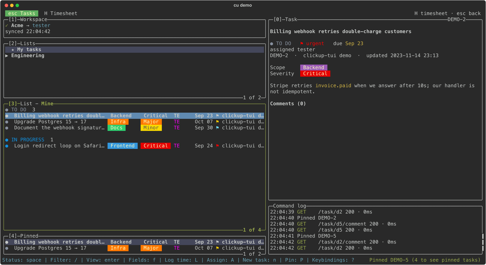
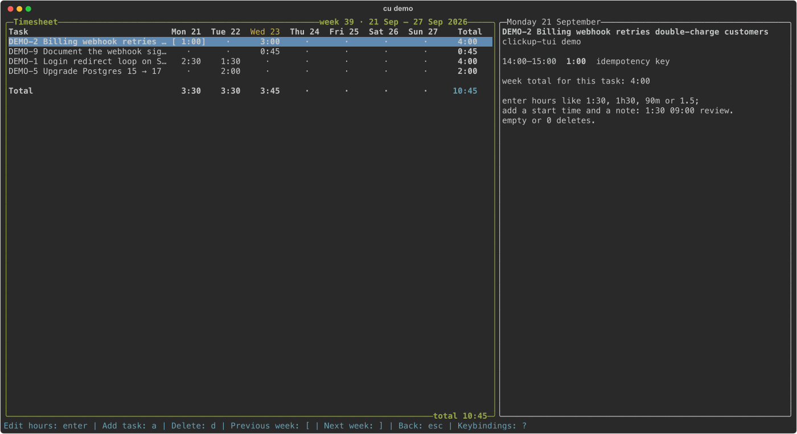

# cu — a fast terminal UI for ClickUp

A lazygit-style TUI for ClickUp, written in Go on [jesseduffield/gocui](https://github.com/jesseduffield/gocui),
the same UI library lazygit is built on.



**Why it's fast:** every view renders instantly from a local SQLite cache and syncs in the
background (stale-while-revalidate). Edits are optimistic: the UI updates immediately and rolls
back if ClickUp rejects the change. The workspace tree loads concurrently, scrolling through
tasks only fetches the one you stop on, and filtering happens in memory.

> **Made with AI.** This tool was vibecoded: written almost entirely by an AI coding assistant,
> with a human steering, testing and deciding what it should do. It exists because ClickUp's web
> and desktop apps are slow: waiting dozens of seconds for a task to show up is normal there, and
> ClickUp's developers haven't put in the effort to fix that. So we built our own fast client on
> their public API instead.

Development happens on [Codeberg](https://codeberg.org/b-wisman/clickup-tui).
[GitHub](https://github.com/Bertus-W/clickup-tui) is a read-only mirror: please open issues and
pull requests on Codeberg.

## Install

**macOS and Linux:**

```sh
curl -fsSL https://raw.githubusercontent.com/Bertus-W/clickup-tui/main/install.sh | sh
```

**Windows** (PowerShell):

```powershell
irm https://raw.githubusercontent.com/Bertus-W/clickup-tui/main/install.ps1 | iex
```

Both install the latest release and check its checksum; `cu version` shows what you have.
`install.sh` puts `cu` in `/usr/local/bin` when it can, else `~/.local/bin`
(`CU_INSTALL_DIR` picks another place); `install.ps1` uses `%LocalAppData%\Programs\cu` and adds
it to your PATH. `CU_VERSION=v0.1.0` installs a specific release. Or download an archive from the
[releases](https://github.com/Bertus-W/clickup-tui/releases) yourself.

**With Go** (1.26 or newer):

```sh
go install codeberg.org/b-wisman/clickup-tui/cmd/cu@latest
```

or from a checkout: `go build -o bin/cu ./cmd/cu`.

## Setup

Just run `cu`. The first time, it asks for your personal API token (in ClickUp: avatar →
**Settings** → **Apps** → **API Token**; it starts with `pk_`), checks it with ClickUp, lets you
pick a workspace and saves both to `~/.config/clickup-tui/config.toml`, readable only by you.
`cu setup` asks again, e.g. to switch token.

You can also set them yourself, which skips the questions:

```sh
export CLICKUP_API_TOKEN=pk_...
export CLICKUP_TEAM_ID=1234567   # optional: which workspace to open (default: the first)
```

or in the config file:

```toml
token = "pk_..."
team_id = "1234567"   # optional
```

The cache lives in `~/.cache/clickup-tui/cache-go.db` (both paths follow `XDG_CONFIG_HOME` and
`XDG_CACHE_HOME`). It's only a cache: delete it any time. On Windows they are
`%AppData%\clickup-tui\config.toml` and `%LocalAppData%\clickup-tui\cache-go.db`.

Works on macOS, Linux and Windows (Windows Terminal recommended). `e` and `C` open `$VISUAL` or
`$EDITOR` (for example `code --wait`), falling back to `vi`, or Notepad on Windows.

## Usage

```sh
cu        # open the TUI (asks for your token the first time)
cu setup  # enter the token and workspace again
cu demo   # try it offline, against a built-in demo project
cu version
cu seed   # create the demo project in your workspace: a list with coloured
          # Scope/Severity fields and 12 tasks. Safe to re-run.
          # Options: -space "Team Space" -list "clickup-tui demo"
```

## Pages and panels

The top row shows the pages as tabs: **Tasks** and **Timesheet**. `H` (hours) opens the timesheet
and `esc` goes back to the tasks; `F2` and `F1` work too, and so does clicking a tab. The running timer, if any, shows at the right of that row.

Like lazygit, the Tasks page is a set of numbered panels; the focused one has a green border and the
bottom line shows its most useful keys. `?` lists every key of the focused panel, and pressing a
key in that list runs it.

| Panel | |
|---|---|
| `[1]` Workspace | workspace, user and sync state |
| `[2]` Lists | spaces, folders and lists |
| `[3]` Tasks | the open list, or `Mine` (tasks assigned to you); switch with `[` `]`. Sorted under a heading per group: by status unless you pick otherwise (`S`) |
| `[4]` Pinned | tasks you pinned, from any list; kept between starts |
| `[0]` Task | the selected task: fields, description, subtasks, comments |
| Command log | every API call with its status and latency (`@` toggles it) |

## Keys

**Everywhere**

| Key | |
|---|---|
| `H` · `esc` | Timesheet page · back to the Tasks page (also `F2` · `F1`, or click the tab) |
| `1` `2` `3` `4` · `0` | focus a panel · the task panel |
| `h` `l` · `←` `→` · `tab` | previous / next panel |
| `J` `K` · `ctrl+d` `ctrl+u` | scroll the task panel from anywhere |
| `?` · `x` | keybindings of the focused panel (pressing a key in the list runs it) |
| `ctrl+p` | jump to any list (type to filter) |
| `g` | go to a task by id, custom id (`DEV-123`) or URL |
| `+` `_` | screen mode: normal → half → full |
| `@` | toggle the command log |
| `R` · `q` | refresh · quit |

**Tasks, Pinned and the task panel**

| Key | |
|---|---|
| `j` `k` · `<` `>` · `,` `.` | move · top / bottom · page (Tasks) |
| `enter` · `esc` | open the task panel · back to the list |
| `space` | status menu with the next status preselected: `space` `enter` moves a task along, numbers jump |
| `s` | find a status by typing |
| `f` | custom fields: every field has a hotkey, dropdown options are numbered, so `f` `e` `2` sets a field |
| `A` · `a` | pick the assignees (`space` toggles, `/` filters, `enter` saves) · assign or unassign me |
| `p` · `t` | priority (`1` urgent … `4` low, `x` none) · due date (`today`, `tomorrow`, `+3d`, `fri`, `31-10` (day first), `2026-10-31`, `none`) |
| `n` · `N` | new task · new subtask (see below) |
| `r` · `e` | rename · edit the description in `$EDITOR` |
| `m` | move to another list (type part of its name) |
| `c` · `C` | comment · comment in `$EDITOR`. `@name` mentions someone; `tab` completes the name |
| `L` | log time (see [Logging time](#logging-time)) |
| `T` · `w` | start or stop a timer · the task's time entries (pick one to edit or delete it, `+` logs more) |
| `P` | pin / unpin |
| `d` · `o` · `y` | delete (asks first) · open in the browser · copy URL, id, name or a markdown link |
| `/` · `v` · `S` | filter by name, id, status, assignee, tag or dropdown value · show closed tasks · sort by status, assignee, priority or due date (Tasks) |

**Lists:** `enter` opens a list, `space` expands or collapses, `/` searches all lists.
**Workspace:** `enter` switches workspace.

Dropdown custom fields show as coloured chip columns in the task list when there's room.

A prompt that can't read what you typed (a date, a number, a time) stays open and says why on its
border, so you can fix the typo instead of typing it all again.

The task panel renders the markdown people write in ClickUp: headings, bold, italic,
strikethrough, code, links, bullets, numbered lists, checklists, quotes and @mentions.

### New tasks

`n` opens a form: type the name, and below it set the status, assignees, priority, due date and
every custom field of the list. Required fields are listed first, marked `*`. `enter` creates the
task, and first walks you through any required field that is still empty, so for a list with a
required Severity it's: type a name, `enter`, `2`, done. `↓` moves from the name into the
fields and `↑` on the first field goes back (`j` `k` and `tab` work too), `enter` edits a field,
`ctrl+s` creates from anywhere and `esc` goes back.

### Logging time

`L` opens the time entry form: type a duration and `enter` logs time that ends now. The input
also takes the whole entry on one line: `45m fixed login`, `2h yesterday`, `1:30 mon 09:00 review`.
The rows below it (day, start, end, note) follow what you type, and you can edit them instead
with `↓` and `enter`. Durations can be written `1:30`, `1h30`, `1h 30m`, `90m`, `45 min`, `1.5`
or `2h`. Day words look back: `mon` means the last Monday.

### Timesheet



`H` opens a week of your time per task and day, like ClickUp's web timesheet. The right
side shows the entries behind the selected cell.

| Key | |
|---|---|
| `h` `j` `k` `l` | move between days and tasks |
| `enter` | add a time entry on that day (always a new entry, also when the day has time already) |
| `e` | edit or delete one entry of that day: pick the entry (skipped when there's one), then `e` edit or `d` delete (asks first) |
| `n` · `d` | add a task row · clear the whole day (asks first) |
| `[` `]` · `w` | previous / next week · this week |
| `esc` | back to the tasks |

`n` offers your pinned tasks, the open list, your tasks and last week's rows (type to search);
`+ another task by id or URL` adds any other. Added rows stay with their week.

Adding and editing use the same form as `L`. Type the duration on top; below
it are the day, the start, the end and a note. The end is calculated from the start and the
duration as you type, and setting the end recalculates the duration instead. A new entry starts
where the day's last entry ends, or at 09:00, so adding time is usually `enter`, a duration,
`enter`. `↓` moves to the fields and `↑` back to the duration (`enter` edits a field), `ctrl+s`
saves, `esc` cancels.

Time tracking needs ClickUp's *Time Tracking* ClickApp enabled in the workspace.

### Mouse

Click a page tab to switch pages, a panel to focus it and a row to select it; double-click a task to open it, or a timesheet
cell to add time to it. Click the `List` / `Mine` tab to switch, scroll with the wheel, and click an
option in a popup to pick it.

## Releases

Tag a version on Codeberg and push the tag: `git tag v0.1.0 && git push origin v0.1.0`. The
mirror carries it to GitHub, where a workflow builds `cu` for macOS, Linux and Windows (amd64
and arm64) with [GoReleaser](https://goreleaser.com), publishes the release, and then installs it
with both install scripts on each system to check them. `goreleaser release --snapshot --clean`
builds the same archives locally, in `dist/`.

## Code

`go test ./...` runs everything against an in-memory fake ClickUp. `CU_LIVE=1 go test -run Live
./internal/app` also checks moving a task and @mentions against your own workspace, on a
throwaway task it deletes afterwards.

```
cmd/cu            entry point: cu, cu setup, cu demo, cu seed, cu version
internal/clickup  API client: typed errors, retries honouring rate limits, page iterators
internal/cache    generic SQLite cache; stale-while-revalidate as an iterator
internal/app      state and actions, independent of the terminal; tested with a scripted UI
internal/gui      gocui panels, popups, keymap and mouse; tested headless, key by key
internal/render   pure formatting: task table and groups, task panel, custom fields, timesheet, markdown
internal/style    ANSI styling, ClickUp colour chips with readable text
internal/parse    user input: task references, due dates, durations, one-line time logs
internal/fake     in-memory ClickUp API for the tests and `cu demo`
internal/seed     the demo project
```

## Development

```sh
go test -race ./...
go run ./cmd/cu demo
```
